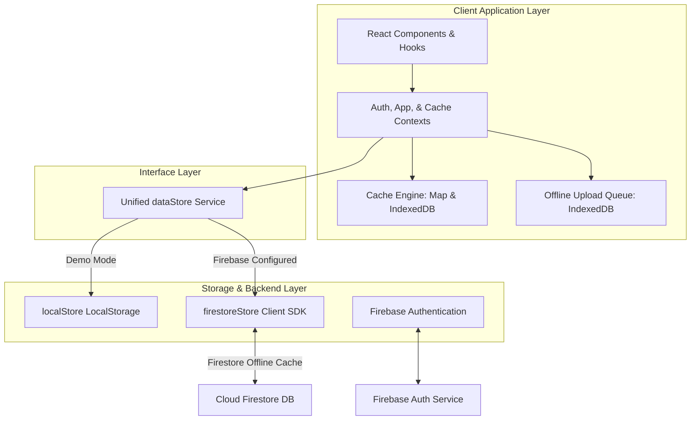
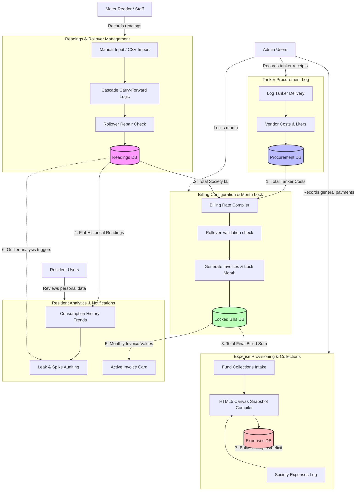

# AquaTrack Technical Documentation

Welcome to the comprehensive technical documentation for **AquaTrack**, an Enterprise Water Consumption & Billing Management System designed for residential communities. 

This document details the system architecture, directory layouts, database schemas, access controls, business logic algorithms, and the offline sync caching engine of AquaTrack.

---

## 1. System Architecture

AquaTrack is architected as an offline-first Single Page Application (SPA). It uses a hybrid storage model that can run completely in the browser (`localStorage` + `IndexedDB`) or link to a cloud backend (`Firebase Auth` + `Firestore`) without changing the application logic.



### Key Architectural Concepts
1. **Dynamic Backend Routing**: The system determines the backend using the environment variable status inside `src/lib/firebase.ts`. All modules invoke the [`dataStore`](file:///Users/moin/Documents/GitHub/aquatrack/src/services/dataStore.ts) interface, which transparently checks the connection mode and forwards calls to either `firestoreStore` or `localStore`.
2. **Offline-First Synchronization**: Since meter readers often collect data in basements or stairwells with poor network connectivity, AquaTrack uses an IndexedDB-backed write queue (`pending-readings`) to persist readings offline. A global event listener detects recovery of internet connection and flushes the queue.
3. **Multi-Layered Caching**: Read operations first query a short-lived memory cache (JS Map). If missing or expired, they query an IndexedDB cache persistence layer. If still missing, they fetch from Firestore, saving the response down the cache hierarchy.

---

## 2. Codebase Structure

The project code is organized inside `src` as follows:

*   **`src/assets/`**: Graphic assets and icons.
*   **`src/components/`**: Reusable React components.
    *   `auth/`: Sign-in, registration, and password forms.
    *   `billing/`: Billing breakdowns, locks, and history widgets.
    *   `charts/`: Recharts-based trend lines, block-wise bars, and heatmaps.
    *   `common/`: Layout widgets, loaders, banners, and protected route wrappers.
    *   `layout/`: Main app shell, side navigation, and top bars.
    *   `notifications/`: Notification cards and badges.
    *   `procurement/`: Vendor setup and tanker intake forms.
    *   `readings/`: Reading input forms, bulk import panels, and timeline indicators.
*   **`src/context/`**: React context providers representing global state engines:
    *   [`AuthContext.tsx`](file:///Users/moin/Documents/GitHub/aquatrack/src/context/AuthContext.tsx): Manages authentication state, user profile loading, demo sessions, and credentials.
    *   [`AppContext.tsx`](file:///Users/moin/Documents/GitHub/aquatrack/src/context/AppContext.tsx): Global state context tracking the active billing month and triggering page-wide data refreshes.
    *   [`CacheContext.tsx`](file:///Users/moin/Documents/GitHub/aquatrack/src/context/CacheContext.tsx): Controls cache configurations, TTL limits, and lists cached entries.
*   **`src/data/`**: Data seeding engines and demo values (e.g. `seed.ts`).
*   **`src/hooks/`**: Custom hooks encapsulating domain processes (e.g., `useNotifications.ts`).
*   **`src/lib/`**: Business logic, math algorithms, utility helper functions, and Firebase initialization.
*   **`src/pages/`**: Main application route endpoints.
*   **`src/services/`**: Low-level database and auth logic services interacting directly with Firestore or LocalStorage.
*   **`src/types/`**: TypeScript type definitions.

---

## 3. Data Models & Schemas

### Type Definitions
All main entities are defined in [`src/types/index.ts`](file:///Users/moin/Documents/GitHub/aquatrack/src/types/index.ts). Below are the core schemas:

#### User Profile
Defines a system user. Users can belong to a specific society (`societyId`) and optional flat (`flatId`).
```typescript
export interface User {
  id: string;
  email: string;
  displayName: string;
  role: UserRole; // 'admin' | 'resident' | 'guest' | 'superadmin' | 'meter_reader'
  flatId?: string;
  societyId?: string;
  assignedBlocks?: BlockId[]; // Assigned areas for meter_readers
}
```

#### Meter Reading
Represents an individual water meter record. To guarantee accountability, audits are appended to the `auditTrail` on edits/deletes.
```typescript
export interface MeterReading {
  id: string;
  flatId: string;
  month: string; // Format: "YYYY-MM"
  openingReading: number; // in Liters
  closingReading: number; // in Liters
  consumptionLiters: number;
  consumptionKL: number;
  enteredBy: string;
  enteredByRole: UserRole;
  createdAt: string;
  updatedAt: string;
  auditTrail: AuditEntry[];
}
```

#### Billing Config
Tracks the month's procurement costs and variables. When `locked` is set to `true`, no further readings or configs can be altered.
```typescript
export interface BillingConfig {
  id: string;
  month: string; // "YYYY-MM"
  tankerCapacityLiters: number;
  tankerCost: number;
  tankerCount: number;
  maintenanceSurcharge: number;
  locked: boolean;
  lockedAt?: string;
  lockedBy?: string;
  billsGeneratedAt?: string;
  billsGeneratedBy?: string;
}
```

#### Flat Bill
Calculated invoice values representing the consumer's share of community water charges.
```typescript
export interface FlatBill {
  flatId: string;
  flat: Flat;
  month: string;
  openingReading: number;
  closingReading: number;
  consumptionLiters: number;
  consumptionKL: number;
  effectiveRatePerKL: number;
  maintenanceShare: number;
  waterCharge: number;
  finalBill: number;
  efficiencyScore: number; // calculated relative to neighbors (0-100)
  lastUpdated: string;
  enteredBy: string;
}
```

---

## 4. User Roles & Access Control

AquaTrack implements a role-based authorization model. Access policies are enforced via route guards and Firebase Security Rules:

| Role | Permitted Pages / Operations | Default Home Route |
| :--- | :--- | :--- |
| **Guest** | View-only access to readings list and analytics. | `/readings` |
| **Resident** | View their own flat bills, consumption history, and personal alerts. | `/resident` |
| **Meter Reader** | View Assigned block dashboard, record, edit, and bulk-import readings. | `/block-dashboard` |
| **Admin** | Read/write readings, manage vendors & procurement, log society expenses, edit billing setups. | `/` (Dashboard) |
| **Superadmin** | Full administrator access, user profiles management, system configuration. | `/` (Dashboard) |

### Route Protection Wrappers
Routing controls in [`ProtectedRoute.tsx`](file:///Users/moin/Documents/GitHub/aquatrack/src/components/common/ProtectedRoute.tsx) guard components dynamically:

*   `ProtectedRoute`: Demands user is authenticated. If profile configuration is incomplete, redirects to `/setup-profile`.
*   `AdminRoute`: Restricts access to `admin` and `superadmin` roles.
*   `BlockDashboardRoute`: Allows access to `admin`, `superadmin`, and `meter_reader`.
*   `SocietyReadingsRoute`: Allows `admin`, `superadmin`, `meter_reader`, and `guest` (blocks `resident` to avoid cross-tenant viewing).
*   `StaffRoute`: Blocks `guest` accounts from sensitive write screens.

---

## 5. Core Business Logic & Calculations

### Water Readings & Cascading Entries
Meter readings are taken sequentially. AquaTrack maintains continuity through two mechanisms in [`readingsService.ts`](file:///Users/moin/Documents/GitHub/aquatrack/src/services/readingsService.ts):

1.  **Opening Reading Resolution**:
    When adding a reading, the system calls `resolveOpeningReading`. If a prior reading exists for the active month, its closing value becomes the opening value for the new entry. Otherwise, the system queries the previous month's summary closing value.
2.  **Downstream Cascading**:
    When a reading is edited or inserted in the past, its new closing value must update the next month's opening value. The `cascadeOpeningToNextMonth` function recursively sweeps forward, re-calculating opening values and adjusting net consumptions (`consumptionLiters = closingReading - openingReading`) to prevent billing gaps.

### Billing Calculations
The calculation engine in [`billing.ts`](file:///Users/moin/Documents/GitHub/aquatrack/src/lib/billing.ts) uses a pooled-cost logic:

$$\text{Total Water Cost} = (\text{Tanker Count} \times \text{Cost Per Tanker}) + \text{Maintenance Surcharge}$$

$$\text{Effective Rate Per kL} = \frac{\text{Total Water Cost}}{\text{Total Society Consumption (kL)}}$$

$$\text{Flat Water Charge} = \text{Flat Consumption (kL)} \times \text{Effective Rate Per kL}$$

$$\text{Flat Maintenance Share} = \frac{\text{Maintenance Surcharge}}{\text{Total Flats}}$$

$$\text{Final Flat Bill} = \text{Flat Water Charge} + \text{Flat Maintenance Share}$$

---

## 6. Offline Synchronization & Caching

### Offline Write Queue
The offline queue in [`readingQueueService.ts`](file:///Users/moin/Documents/GitHub/aquatrack/src/services/readingQueueService.ts) operates on IndexedDB:
1.  **Enqueuing**: If the user records a reading while offline (`navigator.onLine === false`), `saveReading` intercepts the flow, wraps the data in a `PendingReading` wrapper, and persists it to the `pending-readings` IndexedDB object store.
2.  **UI Merging**: When listing readings, `getReadings` reads both indexed Firestore readings and pending items from IndexedDB. The pending items are decorated as simulated `MeterReading` objects, allowing users to see their pending edits in the UI with a pending/offline badge.
3.  **Flushing**: A global event listener on `window.online` executes `flushReadingQueue`. This function processes each pending queue entry sequentially, calling the cloud `persistReading` endpoint. If successful, it deletes the item from IndexedDB. If an error occurs (e.g. validation failure), the item remains in the queue with a logged `lastError` string.

### Caching Engine
The caching engine inside [`cache.ts`](file:///Users/moin/Documents/GitHub/aquatrack/src/lib/cache.ts) uses a dual-layered approach to minimize Firebase read counts:

```
[API Read Request]
        │
        ▼
 ┌──────────────┐      YES
 │ Memory Cache │ ───────────► [Return Data]
 └──────────────┘
        │ NO
        ▼
 ┌──────────────┐      YES
 │  IndexedDB   │ ───────────► [Write to Memory Cache] ──► [Return Data]
 └──────────────┘
        │ NO
        ▼
 ┌──────────────┐
 │  Cloud Db    │ ───────────► [Write to IDB & Memory] ──► [Return Data]
 └──────────────┘
```

Cache entries automatically expire after their configured TTL. Modifying operations automatically invalidate caches via their registered `CacheKeys` prefix.

---

## 7. Progressive Web App (PWA) Integration

AquaTrack is compiled as a PWA using `vite-plugin-pwa`. It is configured to run in **Prompt for Update** mode:

*   **Service Worker**: Handled by Workbox, caching all HTML, JS, CSS, and font files locally.
*   **Dynamic Asset Caching**: Pre-caches static assets and caches remote fonts and UI icons dynamically during runtime.
*   **Offline Manifest**: Includes a `manifest.json` describing theme colors, app icons, and background scopes, allowing the application to be installed on Android, iOS, and desktop browsers.
*   **Online/Offline Banner Notification**: The component [`OfflineSyncBanner.tsx`](file:///Users/moin/Documents/GitHub/aquatrack/src/components/common/OfflineSyncBanner.tsx) displays an indicator on network changes, showing the current count of pending unsynced readings in the queue.

---

## 8. Feature-Level System Architecture

AquaTrack is built around 5 main functional domains. Each domain coordinates UI forms, background validation engines, and storage layers:

### 1. Water Readings & Rollover Management
*   **Purpose**: Records physical meter states and computes net water consumption for each residence.
*   **Key Files**:
    *   [`ReadingsPage.tsx`](file:///Users/moin/Documents/GitHub/aquatrack/src/pages/ReadingsPage.tsx): Panel managing manual entry, editing, and CSV bulk imports.
    *   [`readingsService.ts`](file:///Users/moin/Documents/GitHub/aquatrack/src/services/readingsService.ts): Contains cascades, rollover check actions, and import engines.
    *   [`monthRollover.ts`](file:///Users/moin/Documents/GitHub/aquatrack/src/lib/monthRollover.ts): Validation checks matching a month's opening reading to the preceding month's closing reading.

### 2. Tanker Procurement Tracking
*   **Purpose**: Details logs of external water tanker vendor deliveries, capacity levels, invoice identifiers, and total costs.
*   **Key Files**:
    *   [`TankerProcurementPage.tsx`](file:///Users/moin/Documents/GitHub/aquatrack/src/pages/TankerProcurementPage.tsx): Visual dashboard for ordering, delivering, and cancelling tankers.
    *   [`tankerService.ts`](file:///Users/moin/Documents/GitHub/aquatrack/src/services/tankerService.ts): Validates intake capacity values and totals expenditures per vendor.

### 3. Monthly Billing Cycle & Lock Engine
*   **Purpose**: Determines the community rate per kL and freezes records once calculations are verified.
*   **Key Files**:
    *   [`BillingConfigPage.tsx`](file:///Users/moin/Documents/GitHub/aquatrack/src/pages/BillingConfigPage.tsx): Configuration input and live rate previews.
    *   [`billingService.ts`](file:///Users/moin/Documents/GitHub/aquatrack/src/services/billingService.ts): Runs flat bill computations, writes final bills, and locks the billing configuration.
    *   [`billGeneration.ts`](file:///Users/moin/Documents/GitHub/aquatrack/src/lib/billGeneration.ts): Ensures system constraints are met before lock is allowed.

### 4. Society Maintenance Provisioning
*   **Purpose**: Logs general maintenance costs (lifts, security, electricity) and reconciles against total flat collections to compile reports for residents.
*   **Key Files**:
    *   [`ExpensesPage.tsx`](file:///Users/moin/Documents/GitHub/aquatrack/src/pages/ExpensesPage.tsx): Logs general maintenance expenses.
    *   [`ExpenseSnapshotPage.tsx`](file:///Users/moin/Documents/GitHub/aquatrack/src/pages/ExpenseSnapshotPage.tsx): Compiles provision schedules, records fund intakes, and exports canvas reports.
    *   [`expenseService.ts`](file:///Users/moin/Documents/GitHub/aquatrack/src/services/expenseService.ts): Backend interface for expense storage and provision rollover mapping.

### 5. Resident Portal & Analytics
*   **Purpose**: Serves residents with personal bill breakdowns, history charts, and warning alerts.
*   **Key Files**:
    *   [`ResidentPage.tsx`](file:///Users/moin/Documents/GitHub/aquatrack/src/pages/ResidentPage.tsx): Personal invoice panel, reading timeline, and notification center.
    *   [`FlatAnalyticsPage.tsx`](file:///Users/moin/Documents/GitHub/aquatrack/src/pages/FlatAnalyticsPage.tsx): Detailed analytics, consumption history charts, and average comparison graphs.
    *   [`analyticsService.ts`](file:///Users/moin/Documents/GitHub/aquatrack/src/services/analyticsService.ts): Calculates flat consumption parameters, rolling 3-month averages, and efficiency stats.

---

## 9. Feature Connectivity & Data Flow Graph

The following graph maps the flow of state and data across the different functional modules in AquaTrack. It illustrates how tanker intake and meter readings feed calculations to generate final invoices, which in turn feed the maintenance fund balance sheet and resident analytics:



### Explanation of Connections
1.  **Water Cost Feed**: The [Procurement Database](file:///Users/moin/Documents/GitHub/aquatrack/src/services/tankerService.ts) aggregates all tanker delivery receipts, sending total costs to the `Billing Rate Compiler`.
2.  **Rate Division**: The `Billing Rate Compiler` divides these compiled tanker costs by the total consumption (collected from the [Readings Database](file:///Users/moin/Documents/GitHub/aquatrack/src/services/readingsService.ts)) to establish the month's base rate per kL.
3.  **Bill Locking**: Once the validation engine clears rollover tests, the final invoices are stored persistently in the `Locked Bills DB` and the month is locked.
4.  **Revenue Reconciliation**: The `Fund Collections Intake` reads the sum of all generated resident invoices from the `Locked Bills DB` as the target monthly revenue.
5.  **Surplus Rollover**: The `Canvas Snapshot Compiler` balances this revenue against the general payments registered in the `Expenses DB`. Any remaining balance is written back to the database as the `surplusCarriedForward` parameter, which cascades as the starting balance for the subsequent provisioning month.
6.  **Resident Dashboard Feeds**: The Resident Portal pulls data from two main engines: flat readings from the `Readings DB` for trend analysis, and the generated invoices from the `Locked Bills DB` for payment breakdowns.
